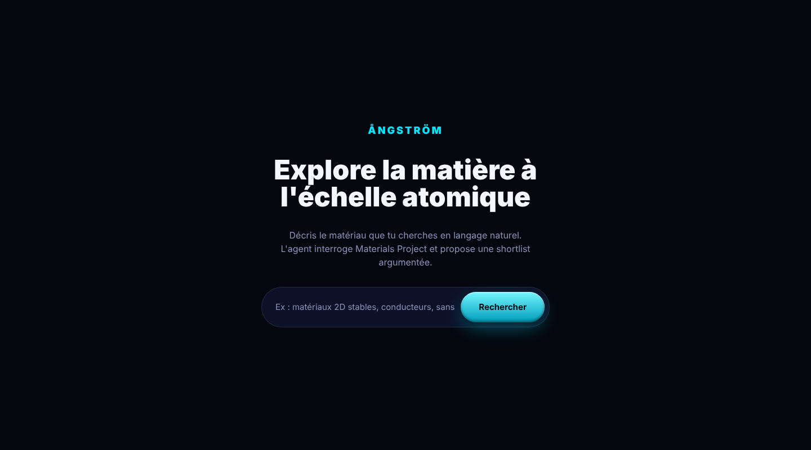
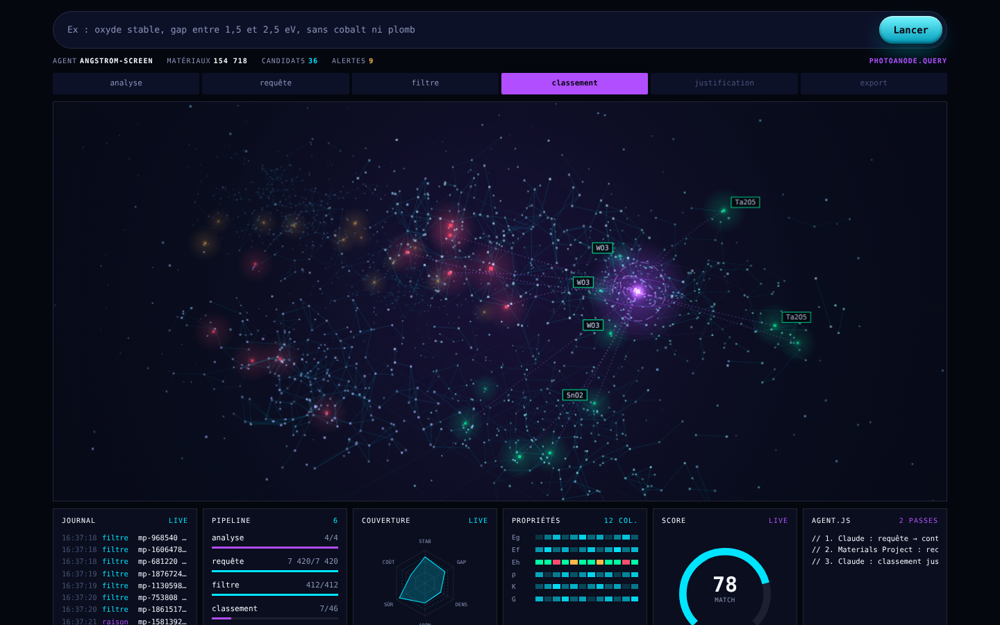
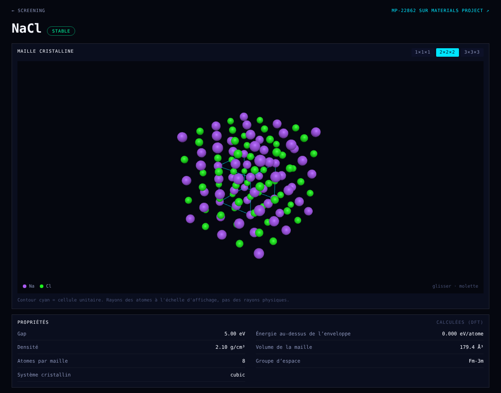
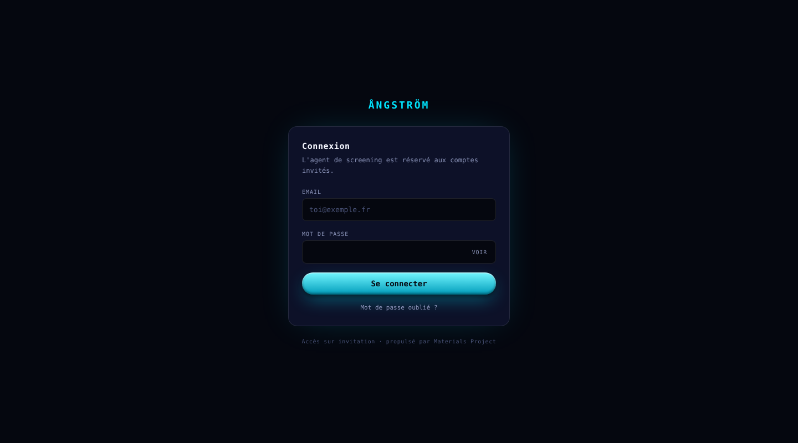

# Ångström

**Agent IA de screening de nanomatériaux en langage naturel.** On décrit ce qu'on cherche (« oxyde stable, gap entre 1,5 et 2,5 eV, sans cobalt »), l'agent traduit la demande en filtres, interroge la base [Materials Project](https://materialsproject.org), croise les résultats et justifie une shortlist, le tout visible en direct dans une interface de type HUD.





> Capture du mode démo : les données affichées sont des **exemples**, pas un vrai appel à Materials Project. Une recherche réelle remplit les mêmes panneaux avec les résultats de l'agent.

## Comment ça marche

Chaque recherche passe par six étapes, diffusées en temps réel (NDJSON) vers l'écran `/screening` :

1. **Analyse** : un LLM transforme la requête en filtres JSON (éléments à inclure ou exclure, gap, stabilité…).
2. **Requête** : appel à `materials/summary` de Materials Project avec ces filtres.
3. **Filtre** : filtre local (énergie au-dessus de l'enveloppe, valeurs manquantes signalées).
4. **Classement** : le LLM classe jusqu'à 20 candidats.
5. **Justification** : 1 à 2 phrases par matériau, fondées uniquement sur les valeurs reçues.
6. **Export** : shortlist avec liens vers les fiches Materials Project.

Principe de conception : **la sortie du LLM n'est jamais une source de confiance.** Les filtres sont revalidés par le code (symboles chimiques, bornes numériques) avant tout appel, les identifiants de matériaux inventés sont écartés, et une valeur absente reste « inconnue » au lieu d'être devinée.

## Fiche matériau : maille cristalline en 3D

Chaque résultat de la shortlist renvoie vers `/material/mp-…` : propriétés calculées (gap, énergie au-dessus de l'enveloppe, densité, groupe d'espace…) et **structure cristalline interactive** (Three.js) : on tourne et on zoome, on passe de la cellule unitaire à une supermaille 2×2×2 ou 3×3×3, et le contour cyan montre la cellule.



> Capture réalisée avec une structure d'exemple (NaCl), pas avec une réponse réelle de Materials Project. La structure reçue de l'API est validée côté serveur (réseau 3×3 numérique, symboles d'éléments valides, 400 atomes maximum) avant d'être envoyée au navigateur.

## Stack

| Couche | Choix |
| --- | --- |
| Frontend | SvelteKit 2, Svelte 5 (runes), Tailwind CSS v4 |
| Rendu | Canvas 2D (nuage de points animé), `prefers-reduced-motion` respecté |
| IA | Groq (`llama-3.3-70b-versatile` par défaut) ou Claude, au choix, via HTTP direct |
| Données | Materials Project REST API (HTTP direct, sans client Python) |
| Auth | Supabase Auth (email + mot de passe, sur invitation) |
| Hébergement | Vercel (`@sveltejs/adapter-vercel`, Node 24) |

## Sécurité

- Les clés (`MP_API_KEY`, `GROQ_API_KEY`, `ANTHROPIC_API_KEY`) ne sont lues que côté serveur, jamais exposées au navigateur.
- `/screening` et `/api/*` exigent un compte connecté. La session est validée auprès de Supabase à chaque requête (cookie `httpOnly`).
- Comptes **sur invitation uniquement** : l'inscription libre est désactivée côté Supabase.
- Limite de 8 recherches par minute et par utilisateur.
- Redirections après connexion restreintes aux chemins internes (pas de redirection ouverte).
- Messages de connexion identiques pour « email inconnu » et « mauvais mot de passe ».

## Installation

```bash
npm install
cp .env.example .env     # puis renseigner les variables ci-dessous
npm run dev
npm test                 # tests sans réseau (faux clients)
```

| Variable | Rôle |
| --- | --- |
| `MP_API_KEY` | Clé Materials Project (gratuite sur le [tableau de bord](https://next-gen.materialsproject.org/api)) |
| `GROQ_API_KEY` | Clé Groq, prioritaire si définie. Optionnel : `GROQ_MODEL` |
| `ANTHROPIC_API_KEY` | Alternative à Groq. Optionnel : `ANTHROPIC_MODEL` |
| `PUBLIC_SUPABASE_URL`, `PUBLIC_SUPABASE_ANON_KEY` | Projet Supabase (clé publique « anon » / « publishable ») |
| `AUTH_DISABLED` | `true` pour désactiver la connexion **en développement local uniquement** |

## Authentification (Supabase)

Dans le tableau de bord Supabase :

1. **Authentication → Sign In / Providers** : désactiver *Allow new users to sign up*.
2. **Authentication → URL Configuration** : *Site URL* = l'URL de production ; ajouter `http://localhost:5173/**` pour le développement.
3. **Authentication → Email Templates** : les liens doivent pointer vers l'application.
   - *Invite user* : `{{ .SiteURL }}/auth/confirm?token_hash={{ .TokenHash }}&type=invite`
   - *Reset password* : `{{ .SiteURL }}/auth/confirm?token_hash={{ .TokenHash }}&type=recovery`
4. **Authentication → Users → Invite user** : l'invité reçoit un email, choisit son mot de passe sur `/account/password`, puis arrive sur `/screening`.



## Déploiement sur Vercel

- Importer le dépôt, ajouter les variables d'environnement ci-dessus (Production et Preview), puis redéployer.
- `package.json` fixe `engines.node` à `24.x` (Vercel n'accepte plus Node 20) et utilise `@sveltejs/adapter-vercel` ≥ 6.3.
- La route `/api/search` déclare `maxDuration: 60` : une recherche enchaîne deux appels LLM et un appel Materials Project.

## Structure

```
src/hooks.server.js            session Supabase + protection des routes
src/lib/server/agent.js        orchestration en deux passes, événements de progression
src/lib/server/{groq,anthropic}.js   fournisseurs LLM interchangeables
src/lib/materialsProjectClient.js    client REST Materials Project
src/lib/hud/                   composants de l'interface (champ canvas, panneaux, jauges)
src/lib/components/CrystalViewer.svelte   maille cristalline 3D (Three.js)
src/lib/server/structure.js    validation de la structure renvoyée par Materials Project
src/routes/material/[id]/      fiche matériau
src/routes/screening/          écran en direct + mode démo
src/routes/{login,auth,account,logout}/   parcours de connexion
```

## Identité visuelle

Cyan `#00E5FF` pour les actions, violet `#B14EFF` réservé au raisonnement de l'agent, vert / ambre / rouge pour la stabilité des matériaux (stable / métastable / instable), fond `#05070F`. Police : JetBrains Mono.

## Limites connues

- La limite de débit est en mémoire : sur Vercel (fonctions serverless), elle n'est pas partagée entre instances.
- Les modèles Groq suivent parfois moins bien le format JSON que Claude : une réponse inexploitable déclenche un message d'erreur, il suffit de relancer.
- Materials Project ne renvoie que les propriétés calculées disponibles : certains matériaux ont un gap ou une densité « inconnus ».

## Pistes

- Liaisons interatomiques estimées dans la maille 3D
- Historique des recherches par utilisateur (Supabase)
- Limite de débit partagée (Redis / KV)
- Export de la shortlist (CSV)

## Source de données

[Materials Project](https://materialsproject.org) : environ 150 000 matériaux avec propriétés calculées. Licence du code : MIT.
